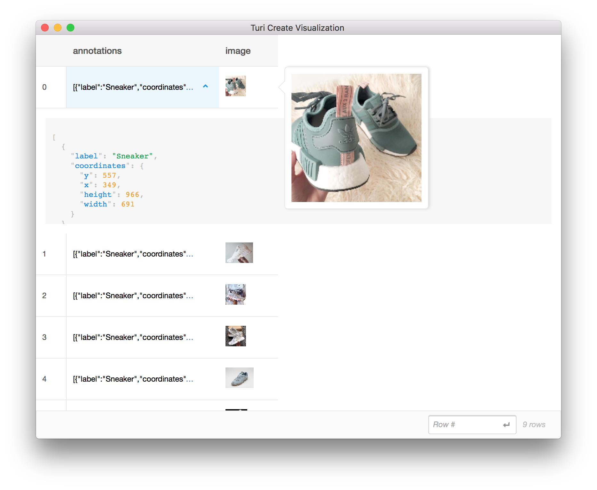

# Walk-through of the creation and training of our sneakers detector
Apple's [Create ML Documentation] (https://developer.apple.com/documentation/create_ml) describes the machine learning model lifecycle in a very simple and "digestible" way.

<p align="center">

</p>

These are the steps that describe the path for the creation and training of our sneakers detection model.

## 1. Get the training images
One easy way is to use Chrome to inject javascript code that can gather the urls while we scroll down a list of Google images. You can find an example in [this article by Adrian Rosebrock](https://www.pyimagesearch.com/2017/12/04/how-to-create-a-deep-learning-dataset-using-google-images/). 


After having the urls.txt we can use any program to download these images to our disk (you can use [the example in this repo](Scripts/download_image_urls.py)).

## 2. Annotate the bounding boxes of the images using Labelbox
Labelbox <https://www.labelbox.com/> is a free and easy tool you can use for annotations.


## 3. Transform the annotated data into a SFrame
Labelbox has the functionality to export the annotated data to a CSV or JSON file. It is then necessary to transform these data to a tabular data structure that can be loaded with Turicreate ([SFrame](https://apple.github.io/turicreate/docs/api/generated/turicreate.SFrame.html)).

This is how a Labelbox annotation looks like: 

```
{
	"External ID": "IMG_6533.jpg",
	"ID": "cjh1on9ola8g80124grkuhca3",
	"Label" :{"Sneaker":[[{"x":292,"y":386},{"x":292,"y":275},{"x":606,"y":275},{"x":606,"y":386}]]},
	"Labeled Data": "https://firebasestorage.googleapis.com/v0/b/labelbox-193903.appspot.com/o/cjfjqe7",
	"Project Name": "SneakerDetector"  
 }
```


The script [annotations_labelboxjson_to_sframe.py](Scripts/annotations_labelboxjson_to_sframe.py) parses the Labelbox annotations json file and creates an SFrame in our disk.

Calling ```sframe_instance.explore()``` in our python code will output a nice way to visualize of our data (images and bounding boxes):


## 4. Train and generate the object detection using Turicreate

As the [Turicreate user guide](<https://github.com/apple/turicreate/tree/master/userguide/object_detection>) demonstrates, we can load our data and train our model with a few lines of python code:

```python
import turicreate as tc

# Load the data
train_data = tc.SFrame('sneakers_detector_data.sframe')

# Make a train-test split
train_data, test_data = data.random_split(0.8)

# Train and create the sneakers detector model
sneakers_detector_model = tc.object_detector.create(train_data)
```
The line ```tc.object_detector.create``` is currently using Apple's re-implementation of [TinyYOLO](<https://pjreddie.com/darknet/yolo/>), an open-source model developed by researchers from the University of Washington. This model was pre-trained with thousands of images to recognise 1000 generic classes (airplanes, cats, bikes, etc.). Roughly speaking, this means that it is already quite good in detecting objects but we want to adapt it to simply recognise sneakers. This process of training over pre-trained models is called [Transfer Learning](<https://github.com/apple/turicreate/blob/master/userguide/image_classifier/how-it-works.md#transfer-learning>).

For more informations about YOLO and object detection, check the [References](references.md) section of this repo.

## 5. Evaluate the model and analyze results
It is crucial to evaluate our model with our test data before using it in our app. 
It is also important to have your test data similar to the data that you are going to predict with your app. In spite of needing just a line of code to save the evaluation results, it is necessary to dive into some machine learning basics to understand the evaluation (e.g.: [Intersection over Union](references.md))

```python
scores = model.evaluate(test_data)
```

For more information on evaluation, you can refer to [Turicreate object detection advance usage](<https://github.com/apple/turicreate/blob/master/userguide/object_detection/advanced-usage.md>).

## 6. Export to a Core ML format
After ensuring that our model is ready to be included in our app, exporting the Turicreate model to a Core ML format is as simple as:

```python
sneakers_detector_model.export_coreml('SneakersDetector.mlmodel')
```

<p align="center">

</p>